# DCIT_205_IA

## ANITA ENYONAM SELORM- 11117590

## Introduction and the purpose of this website
Welcome to my version of the coputer science departments website. This website is a redesign of the University of ghana 
Computer science department website. This website

* provides historical and current information about the computer science department
* includes the two different programs offered by the computer science department of Ghana and the various courses taken
each year
* includes the admissions accepted at the computer science department
* includes the upcoming events for memebers of the department
* includes the ways to get in touch with the department and a form for faster responses

## How to clone and setup the project 
1. Install Git on your local machine preferably from <a href="https://git-scm.com/.">
2. use a web server such as Chrome or Internet explorer among others to host the website locally
3. create a gitHub account
4. fork the repository linked in the DCIT 205 INTERIM ASSESSMENT to your own gitHub account
5. Download VS code onto your local machine
6. click on the source control icon and link git to your vs code
7. click on the souce control icon again; there will be a button that reads "clone Repository" 
8. click on the clone  repository button
8. select the repository you forked and authorize vs code
10. Select a destination for your document and click "yes, i trust the authors" when the pop window appears
11. Click on "new file" and name the file preferably "index.html" (make sure its in the folder you chose as your destination)
12. Open the terminal and type "git init"
13. Press enter and typye " git config --global user.email "the email you used for your git account"
14. press enter and type "git add index.html"
15. press enter and type "git commit -m "a comment to identify what was added"
16. press enter and type "git push"
17. Now you can begin to code 
18. use "git add filename.fileextention (index.html, picture.jpg) to add new files created or added to the folder 
19. press enter and type "git commit -m "a comment to identify what was added" to commit significant changes
20. Finally, push the file(s) 

## What ive learnt through this project

## Ive learnt how to;
1. Fork a repository and pull a request
2. Use different html tags that i wasnt familiar with to achieve a certain look
3. Use CSS to control aspects of visualization and other features to make my project look professional and presentable
4. set up gitHub
5. clone a repository
6. push my files onto github
7. write a professional Readme
8. be creative and produce an attractive interface
9. engage the website user
10. ive also discorved extentions that enhance the use of vs code

## Screenshots of my website
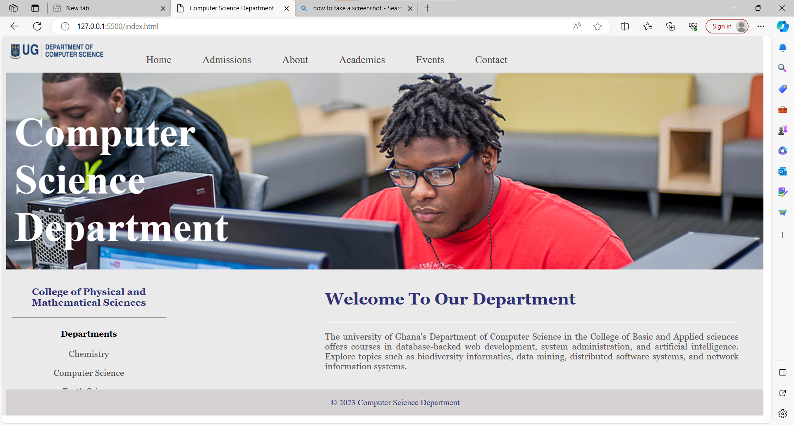

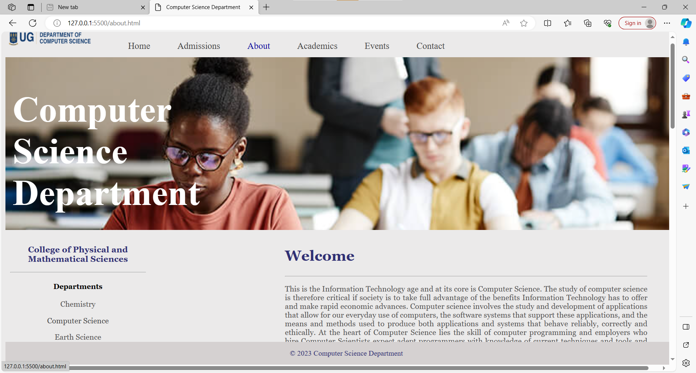
 
 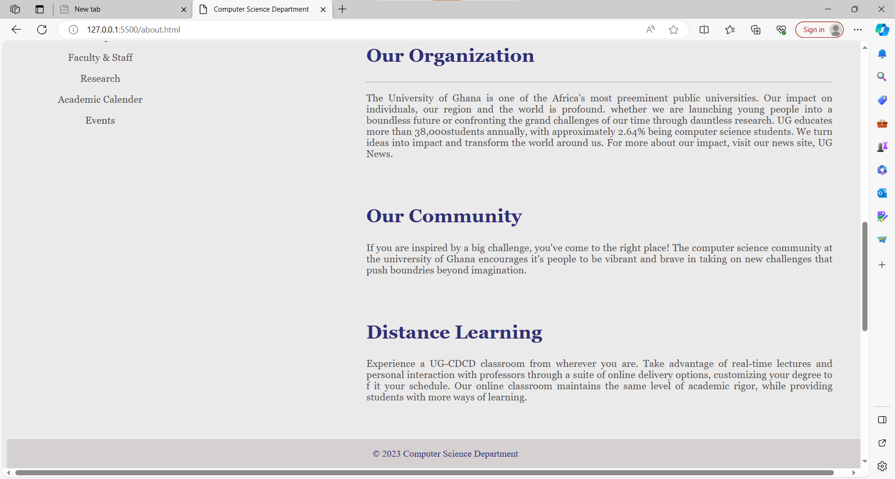
 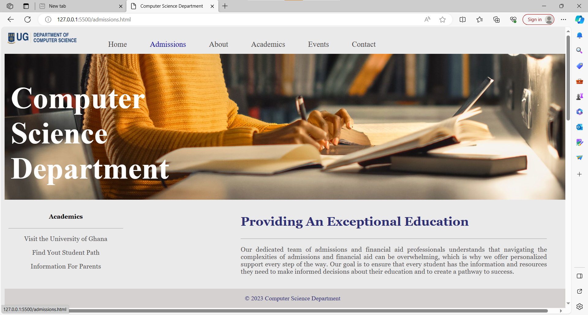
 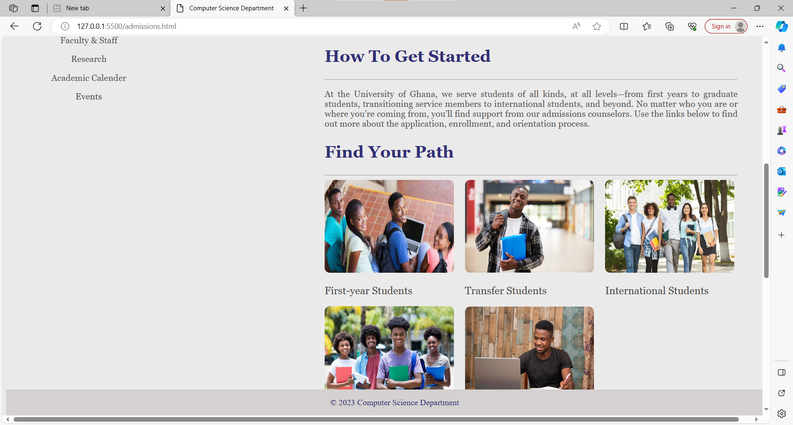
 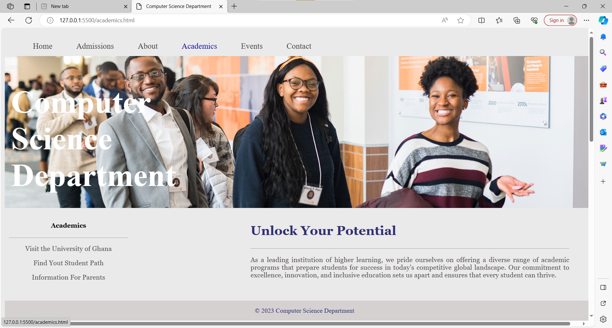
 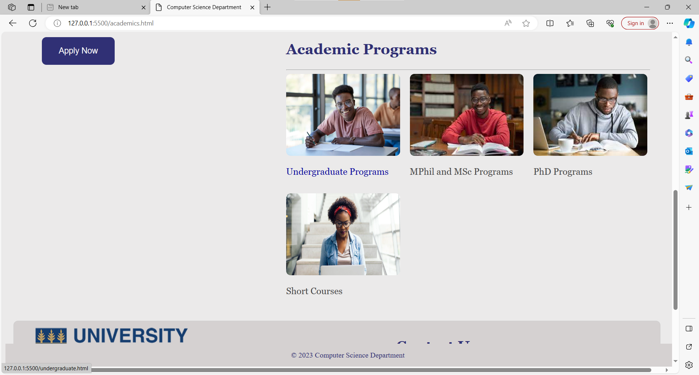
  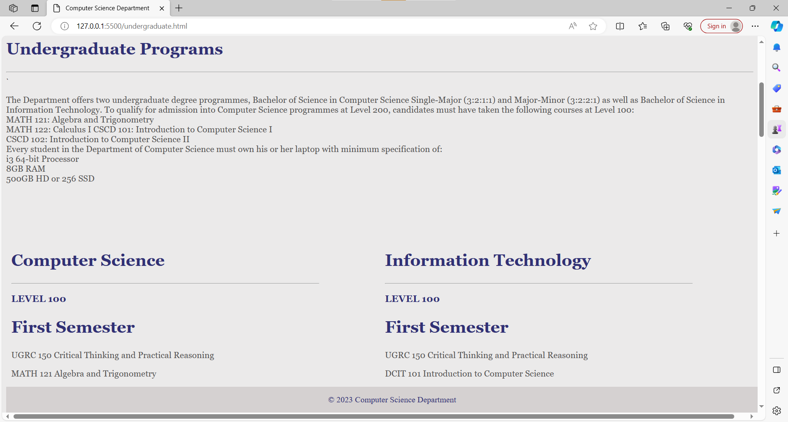
 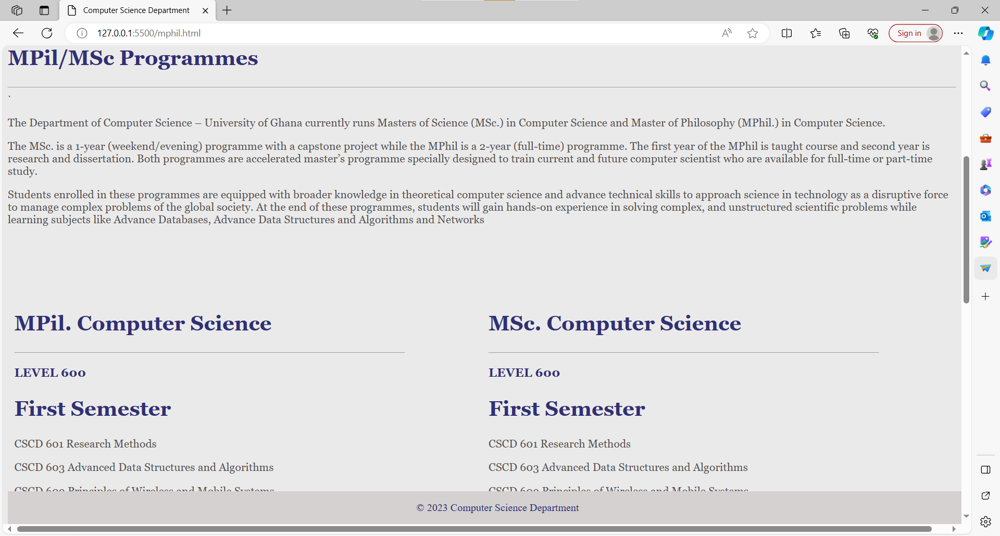
 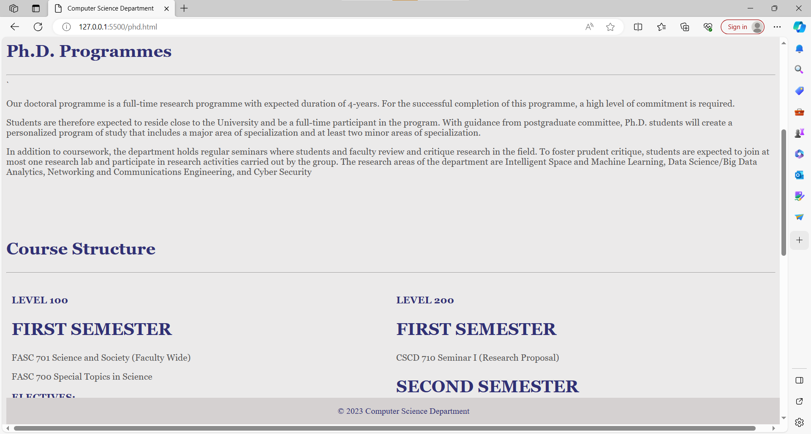
 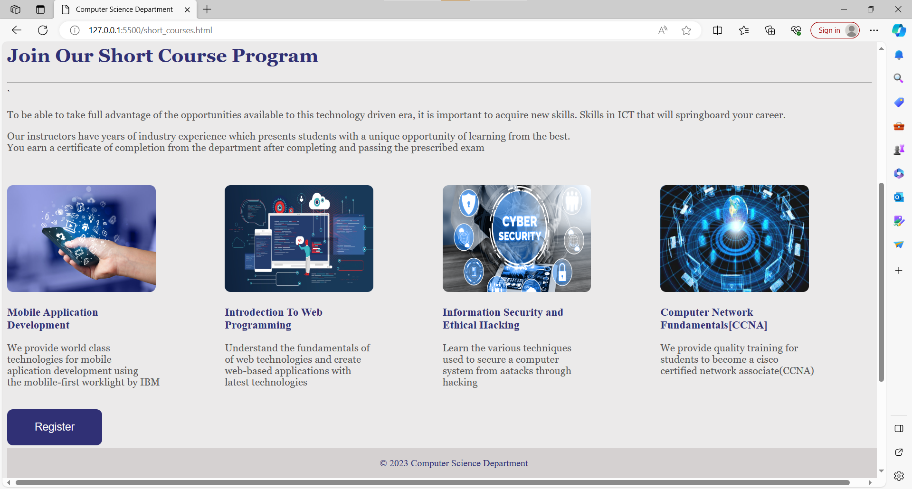 
 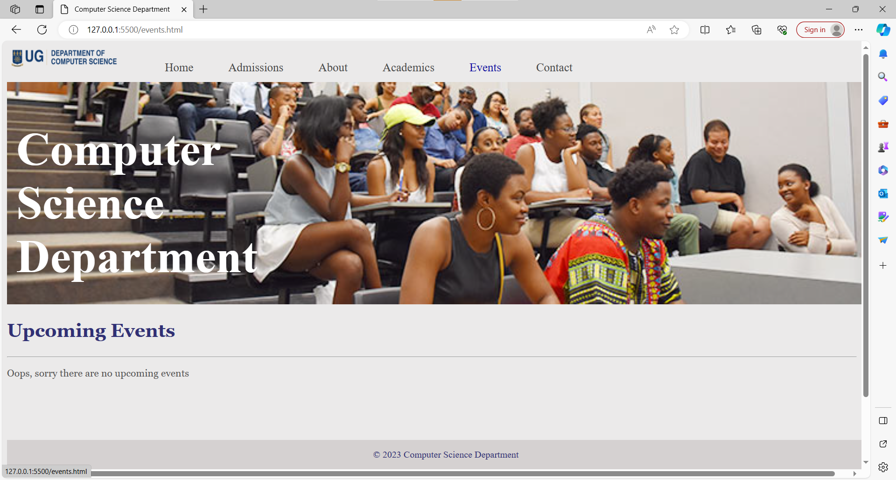
 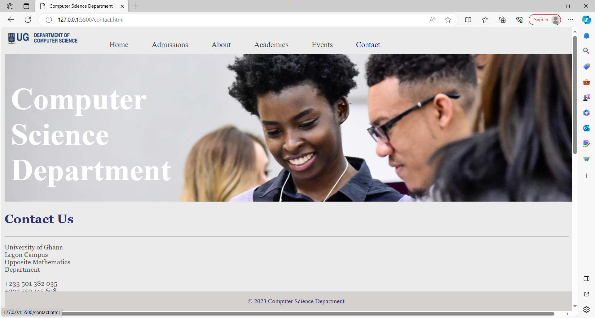
 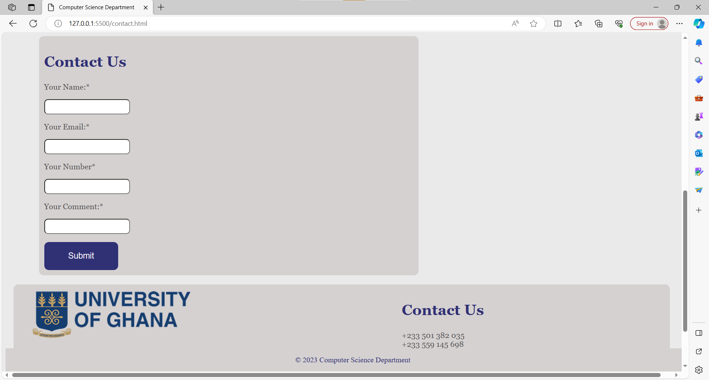

